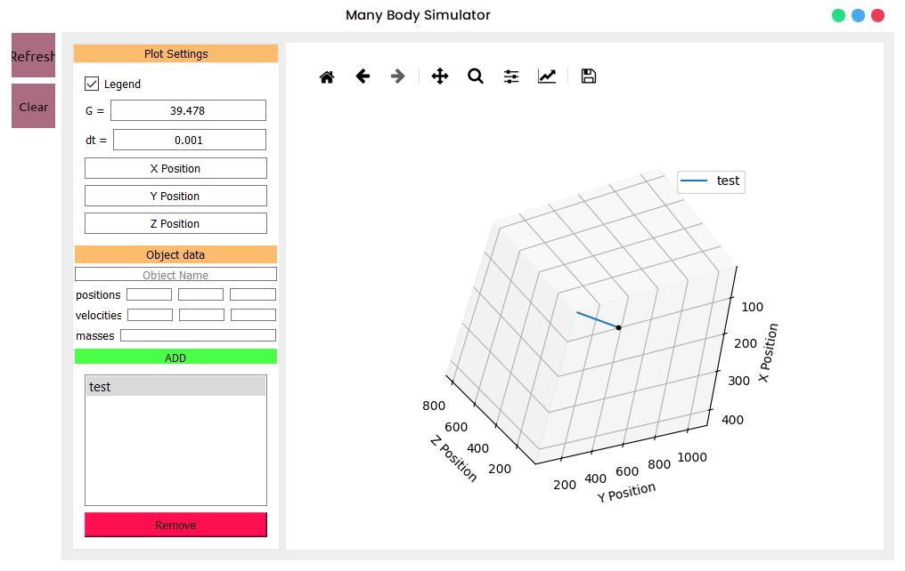

# 🌌 Many Body Simulator (3D GUI-Based)

A Python-based 3D many-body simulation tool with a graphical user interface (GUI). Users can configure gravitational settings, add objects with custom positions and velocities, and visualize interactions in 3D space.

---



---

## 🛠 Features

- ⚙️ Customizable gravitational constant (`G`) and time step (`dt`)
- 🎯 Add multiple particles with defined:
  - Initial **positions**
  - Initial **velocities**
  - **Masses**
- 📊 Real-time 3D visualization (X, Y, Z axes)
- 📌 Interactive controls for:
  - Legend display
  - Viewing angles
  - Saving plots

---

## 📦 Installation

### 1. Clone the repository

```bash
https://github.com/chapayev0/Python-many-body-simulation.git
cd Python-many-body-simulation
